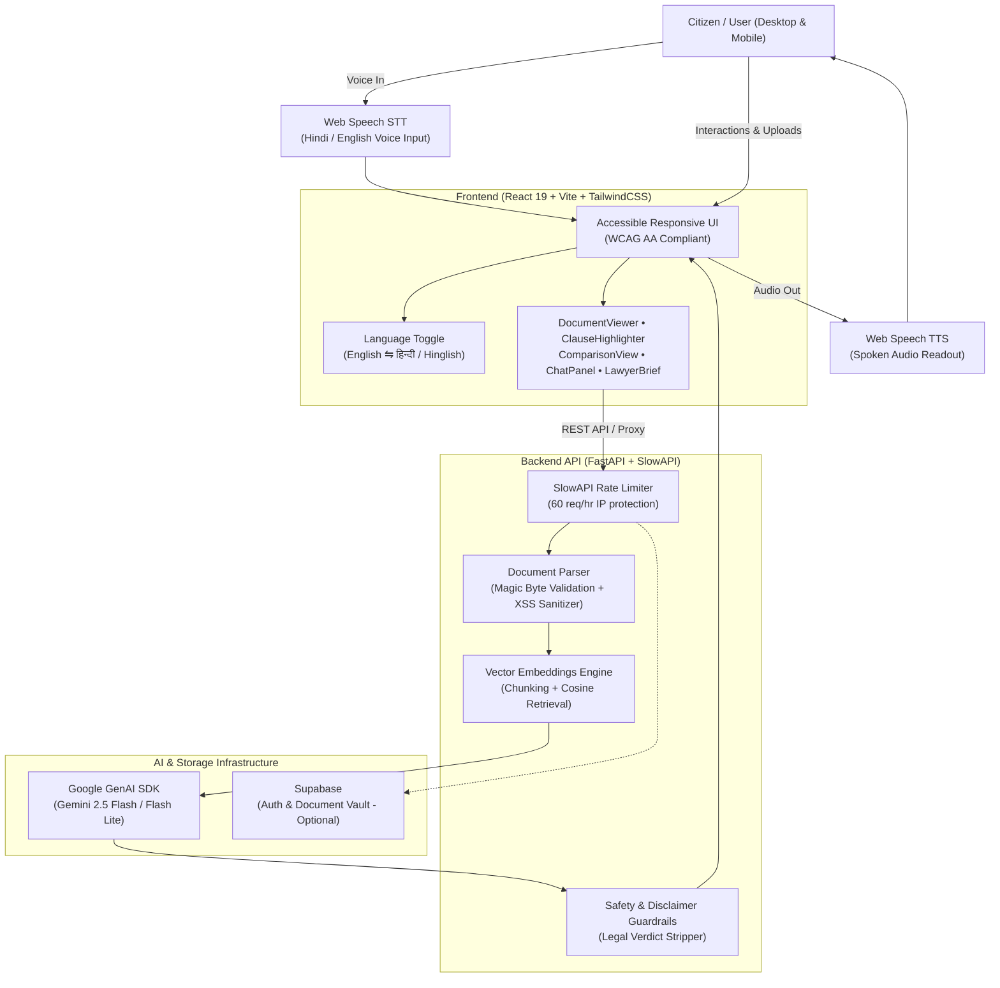

# NyaySetu AI (न्यायसेतु)
### End-to-End GenAI Legal Accessibility Platform for India
**Built for the Hack2Skill PromptWars — "AI for Legal Assistance & Access" Challenge**

[](https://fastapi.tiangolo.com)
[](https://vitejs.dev)
[-4285F4?logo=google&logoColor=white)](https://ai.google.dev)
[-FFB300)](https://developer.mozilla.org/en-US/docs/Web/API/Web_Speech_API)
[-brightgreen)](#-testing--code-quality)
[-blue)](#-repository-constraints--cleanliness)

> **Persistent Legal Disclaimer**: NyaySetu AI provides **informational framing only** and is **not legal advice**. It does not establish an attorney-client relationship. Always consult a licensed legal professional for actionable decisions.

---

## Hackathon Evaluation Criteria Mapping

This table directly maps NyaySetu AI's implementation to the **6 evaluation criteria** of the PromptWars challenge:

| Evaluation Criterion | How NyaySetu AI Solves It | Implementation Location |
|---|---|---|
| **1. Problem Statement Alignment** | Solves India's real justice gap: **Language + Literacy**. Moves beyond generic English simplification to provide a **Hindi/Hinglish-first** document simplification, comparison, and voice-driven Q&A platform for unrepresented citizens. | [DocumentViewer.tsx](frontend/src/components/DocumentViewer.tsx), [ComparisonView.tsx](frontend/src/components/ComparisonView.tsx), [ChatPanel.tsx](frontend/src/components/ChatPanel.tsx), [llm.py](backend/app/services/llm.py) |
| **2. Accessibility (Judged Priority)** | **Voice input (Speech-to-Text) + Voice output (Text-to-Speech)** in Hindi (`hi-IN`) and English (`en-IN`) for low-literacy citizens. Complete audio readout on comparison diffs, full keyboard navigation, `aria-live` regions, WCAG AA color contrast, and badges rendered with **icons + text labels** (never color alone). | [ChatPanel.tsx](frontend/src/components/ChatPanel.tsx), [ComparisonView.tsx](frontend/src/components/ComparisonView.tsx), [ClauseHighlighter.tsx](frontend/src/components/ClauseHighlighter.tsx) |
| **3. Code Quality** | Clean modular architecture with strict separation of concerns (`services/`, `routers/`, `models/`). Strongly typed Pydantic v2 schemas for backend and TypeScript interfaces for frontend. Zero implicit `any`. | [schemas.py](backend/app/models/schemas.py), [api.ts](frontend/src/lib/api.ts) |
| **4. Security & Safety Guardrails** | Strict SlowAPI rate limiting (`60/hr` for chat, upload, and comparison). Magic-byte file validation preventing executable disguised uploads. In-memory content sanitization (removes script/JS injection, no permanent PII stored). Strict negative prompt constraints preventing definitive legal verdicts. | [main.py](backend/app/main.py), [parser.py](backend/app/services/parser.py), [llm.py](backend/app/services/llm.py) |
| **5. Efficiency & Scalability** | Cosine similarity vector search over tokenized chunks (RAG) with instant on-the-fly embedding fallback. Non-blocking async FastAPI endpoints with Uvicorn. Mobile-optimized responsive frontend with Vite proxy routing and HMR. | [embeddings.py](backend/app/services/embeddings.py), [session_store.py](backend/app/services/session_store.py), [vite.config.ts](frontend/vite.config.ts) |
| **6. Testing & Reliability** | **43 automated unit tests across frontend & backend**: 27 pytest tests covering document parsing, magic bytes, XSS sanitization, and clause detection; 16 Vitest tests covering upload, bilingual toggling, clause display, and speech controls. | [test_parser.py](backend/app/tests/test_parser.py), [test_clause_detector.py](backend/app/tests/test_clause_detector.py), [src/tests/](frontend/src/tests/) |

---

## The Key Differentiator: Language + Voice-First Access

> **Why this matters**: Over 85% of Indians do not read or conduct business in English legalese. Furthermore, millions struggle with dense written text even in their native script. Generic legal AI tools merely rewrite English contracts into simplified English. 
> 
> **NyaySetu AI is built Hindi/Hinglish-first with end-to-end voice accessibility**:
> 1. **Bilingual Simplification**: Every agreement is synthesized into conversational English and natural Hindi/Hinglish ("सरल बोलचाल की भाषा") with instant 1-click toggle.
> 2. **Voice-Driven Q&A (STT)**: Users can speak queries into their microphone in Hindi or English (e.g., *"क्या मकान मालिक बिना नोटिस के निकाल सकता है?"*).
> 3. **Spoken Answers & Diff Readout (TTS)**: Summaries and side-by-side agreement diffs are read aloud using browser-native speech synthesis with accurate `hi-IN` and `en-IN` vocal models — essential for illiterate or visually impaired citizens.
> 4. **Strict Safety Guardrails**: Answers are grounded strictly in the uploaded document and automatically sanitized to prevent definitive verdicts (e.g., replacing *"you will win"* with informational framing).

---

## Core Platform Features

### 1. Document Upload & Bilingual Simplification
- Upload PDF or DOCX (rental agreements, employment contracts, terms of service, loan notes).
- Magic-byte validation & sanitization removes any script or binary executable injections before processing.
- Google GenAI SDK (Gemini 2.5 Flash / Flash Lite) generates structured summaries in **both plain English and conversational Hindi**.
- Section-by-section breakdown with original excerpts vs. plain-language explanations.
- Interactive Jargon Glossary translating intimidating legal terms into clear vocabulary.

### 2. Voice-First Q&A with Document Grounding (RAG)
- Users speak queries using their microphone in Hindi or English with automatic pause detection and keyboard submission.
- Semantic vector chunking with cosine similarity retrieves the top relevant excerpts.
- Response is framed informationally and spoken back via browser TTS.
- Strict refusal and boundary enforcement when queries fall outside document scope.

### 3. Clause & Risk Highlighter (WCAG AA)
- Auto-classifies document clauses into 4 semantic categories:
  - **Obligations**: Mandated duties and responsibilities.
  - **Risks & Red Flags**: Unilateral termination, uncapped liability, penalty traps.
  - **Deadlines**: Expiry windows, notice periods, payment milestones.
  - **Financial Terms**: Security deposits, fee escalations, forfeiture rules.
- Accessibility-first: **Always pairs icon + text label alongside color**, never relying on color alone.
- Plain-language "Why this matters" explanation with audio pronunciation.

### 4. Bilingual Document Comparison Mode with Voice TTS
- Compares two versions of an agreement side-by-side (e.g., Original Lease vs. Renewal Lease).
- Semantic diff identifies additions, deletions, and modifications.
- AI generates overall summary, verdict, and numbered key differences in Hindi and English.
- **Dedicated Voice TTS**:
  - Main comparison summary read-aloud button (**बोलकर सुनें** / **Listen Aloud**).
  - Individual **बोलकर सुनें (Voice TTS)** buttons on both Document 1 and Document 2 modified sections so users can hear exactly what each contract version states.

### 5. "Prepare for a Lawyer" Brief Generator
- Converts complex contracts into an organized 1-page consultation brief.
- Generates categorized concerns, financial liabilities, and specific, targeted questions to ask an attorney.
- Instant PDF download formatted for efficient reading by legal counsel during billable consultations.

### 6. User Profile & Identity
- Displays clean, formatted user name in the top navigation bar instead of raw email addresses.
- One-click inline editing (pencil icon) allowing users to personalize their display name with instant persistence to local storage and Supabase metadata.
- Sign-up form includes a dedicated Full Name field.

---

## System Architecture



---

## Technology Stack

| Layer | Technology | Rationale |
|---|---|---|
| **Frontend** | React 19, Vite, Tailwind CSS, Framer Motion | High performance, instant HMR, fluid micro-animations, accessible design. |
| **Backend** | Python 3.11+, FastAPI, Uvicorn | Async performance, auto-generated OpenAPI documentation, fast execution. |
| **LLM & AI** | Google GenAI SDK (`google-genai`), Gemini 2.5 Flash / Lite | Official SDK, low-latency reasoning, robust JSON output with fallback resilience. |
| **Voice / Speech** | Browser-native Web Speech API | Zero client bandwidth overhead, native Hindi & English acoustic models. |
| **Parsing & Security** | PyMuPDF, python-docx, python-magic | Byte-level validation, multi-format parsing, executable disguise rejection. |
| **Testing** | pytest, pytest-asyncio, Vitest, Testing Library | End-to-end regression prevention and component assertion (43 tests). |
| **Rate Limiting** | SlowAPI | Protection against API exhaustion and denial-of-service attempts. |

---

## Quick Launch Scripts

To eliminate the need to memorize or type long terminal commands, convenient launcher scripts are provided:

| Method | Command / Action | Description |
|---|---|---|
| **Short Command** | `.\run` | Runs the backend from project root |
| **Backend Folder** | `python run.py` | Direct launcher inside `backend/` directory |
| **1-Click Backend** | Double-click `start-backend.bat` | Opens and runs backend on `http://localhost:8000` |
| **1-Click Full Stack** | Double-click `start-all.bat` | Launches **both** backend (port 8000) and frontend (port 5173) in separate windows |

---

## Mobile Device & Local Network Testing

The frontend is configured with `host: true` and smart Vite reverse-proxy routing:
- **Same Wi-Fi / Hotspot Access**: Open `http://<your-pc-ip>:5173/` on any smartphone or tablet connected to the same network.
- **Relative API Proxy**: All API calls route through Vite proxy (`/api`), ensuring document uploads and comparisons work on mobile without CORS or localhost issues.
- **Browser Mobile Mode**: Press `F12` followed by `Ctrl + Shift + M` on desktop browsers to preview touch interactions and responsive layouts immediately.

---

## Testing & Code Quality

Both backend and frontend feature comprehensive test suites configured for CI/CD:

### Backend Tests (27 passed)
```bash
cd backend
python -m pytest app/tests/ -v
```
- `test_parser.py`: Tests XSS sanitization, script removal, javascript protocol blocking, magic-byte PDF/DOCX identification, EXE rejection, empty byte handling.
- `test_clause_detector.py`: Tests normalization of arbitrary clause categories, count aggregations, unique ID assignment, and character truncation.

### Frontend Tests (16 passed)
```bash
cd frontend
npm test -- --run
```
- `FileUpload.test.tsx`: Tests drag-and-drop, file type validation (PDF/DOCX), rejection of invalid files, and progress indicators.
- `ClauseHighlighter.test.tsx`: Tests WCAG AA badge rendering (icon + label), filtering by risk/obligation/deadline/financial, and collapsible explanations.
- `DocumentViewer.test.tsx`: Tests instant English-to-Hindi language switching, section accordion toggle, jargon glossary expansion, and ARIA roles.

---

## Security, Privacy & Ethics Guardrails

1. **No Legal Verdicts**: Every LLM prompt is injected with an immutable preamble preventing verdicts (e.g., *"this is illegal"*, *"you will win"*). Post-processing filters regex-strip and replace any unauthorized conclusion patterns in both English and Hindi.
2. **Rate Limiting**: Critical endpoints (`/api/documents/upload`, `/api/chat/*`, `/api/comparison/compare`) enforce rate limits via SlowAPI to prevent token depletion.
3. **Magic-Byte File Verification**: Uploads are verified by their file header bytes (`%PDF-`, `PK\x03\x04`), preventing executable files disguised with fake extensions from ever being processed.
4. **Zero Persistent PII**: Documents are cached only within ephemeral session memory with automatic cleanup.
5. **Secret Hygiene**: Real API keys are never committed; `.env` is rigorously ignored, and `.env.example` provides sanitized templates.

---

## Deployment Guide

### Deploy Backend to Render
1. Push this repository to GitHub.
2. Log into [Render Dashboard](https://dashboard.render.com).
3. Click **New > Blueprint** and select your repository (Render automatically reads `render.yaml`).
4. Set the environment variable `GEMINI_API_KEY` in the Render dashboard.
5. Your backend service will be live at `https://nyaysetu-backend.onrender.com`.

### Deploy Frontend to Vercel
1. Log into [Vercel](https://vercel.com).
2. Import the repository and set **Root Directory** to `frontend`.
3. Set the Environment Variable:
   ```
   VITE_API_BASE_URL=https://your-backend-app.onrender.com
   ```
4. Click **Deploy**. Vercel will build using Vite and route all client paths through `frontend/vercel.json`.

---

## Local Setup Instructions

### 1. Prerequisites
- Python 3.11+
- Node.js 18+
- [Google Gemini API Key](https://aistudio.google.com/app/apikey)

### 2. Backend Setup
```bash
# Clone the repository
git clone https://github.com/MOHDUBES/NyaySetu-AI.git
cd NyaySetu-AI/backend

# Create virtual environment
python -m venv venv

# Activate virtual environment
# Windows:
venv\Scripts\activate
# macOS/Linux:
source venv/bin/activate

# Install dependencies
pip install -r requirements.txt

# Configure environment
cp ../.env.example .env
# Open .env and add your GEMINI_API_KEY

# Run server
python run.py
```
API Documentation will be accessible at: `http://localhost:8000/docs`

### 3. Frontend Setup
```bash
cd ../frontend

# Install dependencies
npm install

# Run dev server
npm run dev
```
Open `http://localhost:5173` in Google Chrome or Microsoft Edge for optimal Web Speech API voice support.

---

## Repository Constraints & Cleanliness

- **Single Branch**: All development consolidated cleanly on `main`.
- **Repository Footprint**: Minimal, clean code footprint (strictly excludes `node_modules`, `dist`, `.venv`, and temporary artifacts).
- **Environment Safety**: Zero committed credentials or API keys.

---

## Disclaimer
NyaySetu AI is an assistive GenAI tool developed for research and educational purposes during Hack2Skill PromptWars. It is not an attorney and does not replace human legal counsel.
